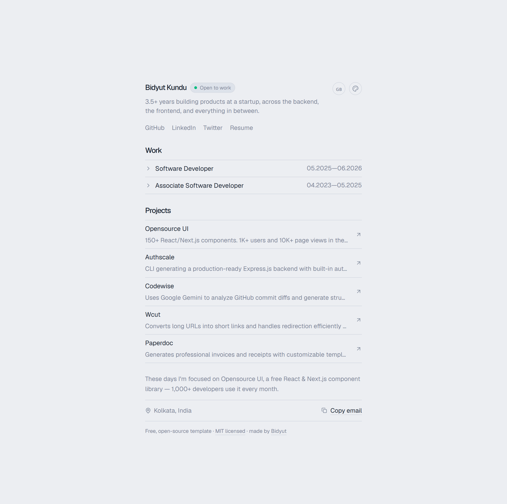

## Bidyut Kundu (one-page portfolio)



Free, open-source, MIT-licensed. Next.js + Tailwind CSS v4 + `motion` +
`lucide-react`. See `CLAUDE.md` for a full breakdown of conventions if
you're extending this with AI assistance (or just want the reasoning behind
some of the choices below).

## Getting started

```bash
npm install
npm run dev
```

## Before you run it

Add your resume PDF to `public/pdfs/Software_Engineer-Bidyut_Kundu.pdf` (or
update the path in `lib/config.ts`) and your project images as well.

### About the license and "starring"

`LICENSE` is standard, unmodified MIT — genuinely free to use, modify, and
redistribute, no conditions attached. I did **not** make starring the repo a
license requirement, because that would stop it from actually being MIT
(you can't legally bolt extra obligations onto a permissive license and
still call it MIT). What I did instead: a clearly-separated, non-binding
line in `LICENSE` and a footer credit on the site itself, asking — not
requiring — a ⭐ if someone uses it. Update `siteConfig.template.repoUrl`
once this is pushed to its real repo (it currently points at your GitHub
profile as a placeholder).

## Make it yours

- `lib/config.ts` — all content. Text fields you want translated are
  `{ en, fr, es, bn }` objects.
- `lib/i18n.ts` — chrome labels + the locale list (flags + native names).

## Structure

```
app/
  layout.tsx    Geist font, metadata from config
  page.tsx       assembles the sections, sized for one screen (sm:h-dvh)
  globals.css     Tailwind v4 import + theme CSS variables + resets
components/
  theme-provider.tsx / theme-switcher.tsx      theme state + popover
  locale-provider.tsx / language-switcher.tsx   i18n state + flag popover
  popover-button.tsx    shared compact popover used by both switchers
  nav-bar.tsx             name, tagline, text-only social/resume links
  work-section.tsx         accordion roles, 2 highlights each
  projects-section.tsx      rows + cursor-following gradient preview
  about-section.tsx          current-focus line, contact, footer credit
lib/
  config.ts    content + themes, localized per-field
  i18n.ts       UI-chrome translations
LICENSE      MIT
CLAUDE.md     conventions and do-not-do list for AI-assisted edits
```
